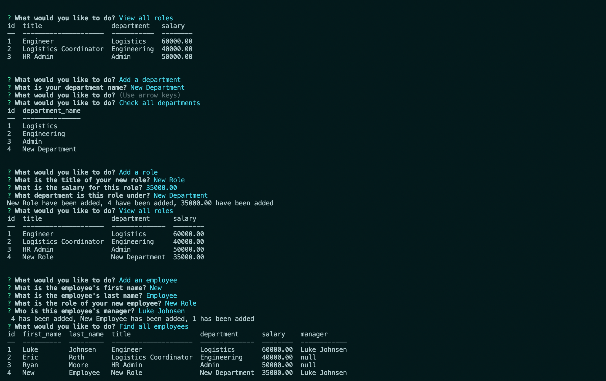

# Employee Tracker Application

## Description
This employee tracker application allows HR or company administrators access to basic employee information and references via command line operations.

## Table of Contents (Optional)
* [Installation](#installation)
* [Usage](#usage)
* [Credits](#credits)
* [License](#license)
* [Contributing](#contributing)
* [Test](#test)
* [Questions](#questions)

## Installation
Repo can be cloned from my GitHub and dependances can be found in the package.json file.

## Usage
This is what it will look like on your device. 

To start application type "node index.js" into your command line terminal.

## Contributing
Luke Johnsen and assistance from Nick Kepers

## Tests 
N/A

## Questions
Please check out [Github](https://github.com/lukejohnsen) to see my other projects.